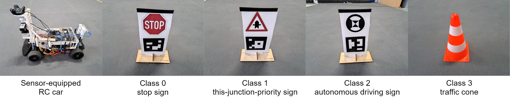

# Freicar group 1 final project: Traffic sign detection and pose estimation

For autonomous driving, it is key to detect traffic signs and to map them.

This project is part of the [FreiCar lab course](freicar.informatik.uni-freiburg.de/) at the University of Freiburg, Germany.

Chosen landmarks for mapping were the German stop sign, the this-junction-priority sign, the autonomous driving landmark sign and orange traffic cones. These have been distributed manually in a robot hall. Afterwards, one of the FreiCar cars was driven remote-controlled through the hall, recording the front camera image ([Intel RealSense D435](https://www.intelrealsense.com/depth-camera-d435/)) and ground-truth poses from an indoor localization system ([HTC Vive Tracker](https://www.vive.com/us/accessory/tracker3/)). Object detection and mapping were run offline on a powerful machine.



Traffic signs were printed out to paper and glued on wooden mounts. The size of the traffic signs is 10x10 centimeters. Below, an [ARUCO marker](https://learnopencv.com/augmented-reality-using-aruco-markers-in-opencv-c-python/) encoding the sign type was printed.

## Training the YOLOv7 model

For object detection of camera images with traffic signs, we obtained best results using the YOLOv7X neural network, pretrained on the COCO dataset (download [here](https://github.com/WongKinYiu/yolov7/releases/download/v0.1/yolov7x.pt)).

See below for instructions on how to convert between the label formats.

We trained all layers on the [GTSRB dataset](https://benchmark.ini.rub.de/gtsrb_dataset.html), only including the stop sign (class 14) and this-junction-priority sign (class 11):
```bash
$ python train.py \
    --cfg cfg/training/yolov7x_freicar.yaml \
    --data data/freicar-gtsrb.yaml \
    --weights yolov7x.pt \
    --cache-images \
    --epochs 400 \
    --batch-size 8 \
    --img-size 640 640 \
    --multi-scale
```

Afterwards, we freezed most of the layers and trained the model on our own small traffic sign dataset, using the following command:

```bash
$ python train.py \
    --cfg cfg/training/yolov7x_freicar.yaml \
    --data data/freicar-1-2.yaml \
    --weights PathToBestWeightsOfTrainingOnGTSRB.pt \
    --cache-images \
    --epochs 400 \
    --batch-size 16 \
    --img-size 640 640 \
    --multi-scale \
    --freeze 10
```

The resulting best weights file (`runs/train/expXX/best.pt`) was used for the inference ROS node.

### GTSRB to COCO label coverter

After downloading the [GTSRB dataset](https://benchmark.ini.rub.de/gtsrb_dataset.html) (see `gtsrb-to-coco/download_dataset.sh`), the label format needed to be converted into the COCO label format used by YOLOv7.

This is done by running `$ cd gtsrb-to-coco` and afterwards `$ python gtsrb-to-coco.py`.

Because stop signs and this-junction-priority signs are the only ones from the dataset that were used in our project, the script only converts samples of these two classes.

### Labelme to COCO label converter

Furthermore, we created our own dataset consisting of ~900 images taken in our robot hall. We annotated them manually using [labelme](https://github.com/wkentaro/labelme). If you are interested in our dataset, please contact us.

To convert the label format used by labelme to the COCO label format, run `$ cd labelme-to-coco` and afterwards `$ python labelme2coco.py`.

## ROS nodes 

The project consists of three [ROS](https://www.ros.org/) nodes.

### Mapping algorithm

The mapping algorithm is located in the `freicar_mapping` directory.

...

### YOLOv7 traffic sign detector

The traffic sign detector is located in the `freicar_traffic_sign_detect` directory.

Using the [YOLOv7](https://github.com/WongKinYiu/yolov7) neural network by Wang et al. and images from the car front camera, bounding boxes of traffic signs are detected. They are classified and passed to the mapping algorithm.

YOLOv7's [original repository](https://github.com/WongKinYiu/yolov7) has been cloned and extended in order to integrate it into the ROS and FreiCar ecosystem.

### ARUCO marker traffic sign detector

The mapping algorithm is located in the `freicar_aruco_detect` directory.

...

## Building and running the ROS nodes

Please follow these instructions for building and running the ROS nodes.

### Mapping algorithm and ARUCO marker detection

The commands have to be run inside the docker in the `~/freicar_ws` directory.
- To build the nodes:
```
catkin build -cs
```
- To run the nodes:
```
# Street sign detection node:
rosrun freicar_street_sign street_sign.py
# Mapping node:
rosrun freicar_mapping mapping_node.py
```
If the packages aren't found, check `echo $ROS_PACKAGE_PATH`
- To clean the build artifacts just for our nodes:
```
catkin clean freicar_street_sign
catkin clean freicar_mapping
```

### Traffic sign detection (YOLOv7)

#### Initial setup

1. `$ cd freicar_traffic_sign_detect`
2. `$ pip install virtualenv`
3. `$ virtualenv .venv`
4. `$ source .venv/bin/activate`
5. `$ pip install -r yolov7/requirements.txt`

#### Running the inference node

Please have a look at the beginning of the file `freicar_traffic_sign_detect/yolov7/inference-ros-node.py` and ensure the configuration (e.g. ROS topics, path to the model weights, confidence thresholds) is correct.

1. `$ cd freicar_traffic_sign_detect/yolov7`
2. `$ source .venv/bin/activate`
3. `$ python inference-ros-node.py`
